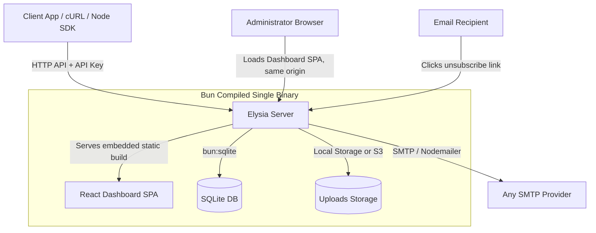

# Mail Buddy - Project Plan

**Mail Buddy** is an open-source, self-hostable email template manager and delivery API. It packages a beautiful React-based template editor (powered by React Email components/editor patterns) and a fast Elysia-based API into a **single-executable binary** compiled with Bun — the same binary serves both the admin dashboard and the REST API.

---

## 1. System Architecture



### Key Design Goals:
- **Zero External Runtime Dependencies:** Distributed as a single compiled executable — no Docker, no separate frontend deployment, no external database process.
- **Lightweight Application Footprint:** The React SPA build is embedded directly into the compiled binary, adding well under 1MB to it - the app code itself stays small even though the total executable is larger (see the packaging note in section 6).
- **Embedded Database:** SQLite is used via the high-performance native `bun:sqlite` driver with Drizzle ORM.
- **Same-Origin UI:** The React dashboard is served by the same Elysia server as the API. There is no separate hosted dashboard and no CORS configuration required for the default setup.

---

## 1.5. Product Niche & Market Positioning

### Why Mail-Buddy? (Our Niche)
* **The Visual Editor Gap:** Most self-hosted mailing tools (like listmonk) expect users to write raw HTML or basic Markdown. Mail-Buddy addresses this by integrating a modern, drag-and-drop block builder (inspired by React Email/EmailBuilder.js) inside a self-hosted utility.
* **Single-Binary Portability & Drizzle:** Using Drizzle ORM and Bun's native SQLite driver avoids packaging heavy native Rust database engines - no separate database process, no native migration binaries. The application code itself (server + embedded dashboard) is a small fraction of the final executable; most of its size is Bun's embedded runtime (see section 6), which is fixed regardless of app complexity and compiles cross-platform instantly.
* **Single-Binary UI + API:** The React SPA Dashboard is built at compile time and embedded directly into the compiled Elysia binary, which serves it alongside the REST API from the same origin. There is no separate dashboard deployment, no CORS setup, and no Docker packaging required — you run one executable and get both the admin UI and the API.
* **Dynamic Template Embedding (`{{embed "uuid"}}`):** Mail-Buddy allows modular component design. Users can nest templates dynamically in Handlebars, automatically merging placeholders and required variables recursively.

### Non-Goals
To keep scope tight, Mail-Buddy explicitly does **not** aim to be:
* **A multi-user / RBAC system.** Access control is API keys with two scopes (`admin`, `send_only`) — there are no user accounts, roles, or permission trees.
* **An audience / list management platform.** There are no contacts, lists, or segments. Mail-Buddy tracks a single per-template (or global) **suppression list** so it never re-emails someone who opted out — but the caller's own backend owns who is actually on a mailing list and what their attributes are.
* **An analytics/tracking platform.** No open/click tracking, no bounce webhook processing.
* **A CMS with template versioning.** Templates are edited in place; there's no revision history or rollback.

### Storage Strategy (Local vs. S3)
To ensure stateless container friendliness (e.g. hosting on Fly.io, Heroku, or ECS where local filesystems can be ephemeral), Mail-Buddy supports two storage drivers configured via environment variables:
1. **`local` (Default):** Uploaded images are stored in a local directory (`./uploads`) alongside the binary.
2. **`s3`:** Uploaded images are uploaded directly to an S3-compatible bucket.
   * **Required Credentials & Settings:**
     * `STORAGE_PROVIDER=s3`
     * `S3_BUCKET_NAME` (The S3 bucket identifier)
     * `S3_ACCESS_KEY_ID` (AWS Access Key or provider counterpart)
     * `S3_SECRET_ACCESS_KEY` (AWS Secret Key or provider counterpart)
     * `S3_REGION` (e.g., `us-east-1`)
     * `S3_ENDPOINT` (Optional, for custom endpoints like Cloudflare R2, MinIO, or DigitalOcean Spaces)

---

## 2. Technical Stack

| Component | Technology | Rationale |
| :--- | :--- | :--- |
| **Runtime & Bundler** | [Bun](https://bun.sh/) | Fast runtime, built-in bundling/packaging, and native support for compiling into a single binary (`bun build --compile`), including embedding static assets. |
| **Backend Framework** | [Elysia.js](https://elysiajs.com/) | Extremely fast web framework for Bun with native TypeBox validation, static file serving, and OpenAPI/Swagger documentation. |
| **Database & ORM** | SQLite (`bun:sqlite`) & [Drizzle ORM](https://orm.drizzle.team/) | Extremely fast built-in SQLite driver paired with a zero-dependency, lightweight, type-safe query builder and automatic startup migrations. |
| **Authentication** | Database-backed API Keys (hashed, scoped) | Bearer-token authentication against hashed keys stored in SQLite. No session cookies, no CORS-cookie restrictions, no single static admin secret. |
| **Frontend Framework** | React + Vite + TailwindCSS | Admin dashboard UI, built to static assets and embedded into the compiled server binary — not deployed separately. |
| **Email Templating** | React Email & Handlebars | Component-based visual editing, HTML rendering, and resolving placeholders/conditionals via Handlebars.js. |
| **SMTP Delivery** | Nodemailer (or standard SMTP socket wrapper) | Robust email sending protocol support with TLS/SSL. |
| **Node SDK Build** | [tsup](https://tsup.egoist.dev/) | Zero-config dual ESM/CJS bundling with `.d.ts` generation for the published `mail-buddy-sdk` npm package. |

---

## 3. Database Schema (Drizzle)

We will use Drizzle ORM to define the SQLite database schema and handle migrations.

> [!NOTE]
> All `CURRENT_TIMESTAMP` defaults use `sql\`(CURRENT_TIMESTAMP)\`` (imported via `import { sql } from 'drizzle-orm'`), not the bare string `'CURRENT_TIMESTAMP'` — the latter would insert the literal string as the default value instead of invoking SQLite's function.

```typescript
// src/db/schema.ts
import { sqliteTable, text, integer } from 'drizzle-orm/sqlite-core';
import { sql } from 'drizzle-orm';

export const templates = sqliteTable('template', {
  id: text('id').primaryKey(), // UUIDv4
  name: text('name').notNull(),
  description: text('description'),
  htmlContent: text('html_content').notNull(),
  designJson: text('design_json'), // Serialized JSON string of editor state
  placeholders: text('placeholders').notNull(), // JSON string array of variable names
  createdAt: text('created_at').default(sql`(CURRENT_TIMESTAMP)`),
  updatedAt: text('updated_at').default(sql`(CURRENT_TIMESTAMP)`),
});

export const assets = sqliteTable('asset', {
  id: text('id').primaryKey(), // UUIDv4
  filename: text('filename').notNull(),
  originalName: text('original_name').notNull(),
  mimeType: text('mime_type').notNull(),
  fileSize: integer('file_size').notNull(),
  urlPath: text('url_path').notNull(),
  createdAt: text('created_at').default(sql`(CURRENT_TIMESTAMP)`),
});

export const deliveryQueue = sqliteTable('delivery_queue', {
  id: text('id').primaryKey(), // UUIDv4
  recipient: text('recipient').notNull(),
  subject: text('subject').notNull(),
  htmlContent: text('html_content').notNull(),
  status: text('status').default('pending').notNull(), // 'pending', 'processing', 'sent', 'failed'
  attempts: integer('attempts').default(0).notNull(),
  maxAttempts: integer('max_attempts').default(5).notNull(),
  lastError: text('last_error'),
  runAt: text('run_at').default(sql`(CURRENT_TIMESTAMP)`).notNull(),
  createdAt: text('created_at').default(sql`(CURRENT_TIMESTAMP)`).notNull(),
});
// Recommended index: (status, run_at) — the delivery worker polls on exactly this pair.

export const deliveryLogs = sqliteTable('delivery_log', {
  id: text('id').primaryKey(), // UUIDv4
  recipient: text('recipient').notNull(),
  subject: text('subject').notNull(),
  templateId: text('template_id'),
  status: text('status').notNull(), // 'success', 'failed', 'skipped' (skipped = suppressed recipient)
  errorMessage: text('error_message'),
  sentAt: text('sent_at').default(sql`(CURRENT_TIMESTAMP)`),
});

// Generic key/value config store: SMTP settings, storage settings. Managed via /api/settings.
export const settings = sqliteTable('setting', {
  key: text('key').primaryKey(),
  value: text('value').notNull(),
});

export const apiKeys = sqliteTable('api_key', {
  id: text('id').primaryKey(), // UUIDv4
  name: text('name').notNull(), // user-given label, e.g. "Zapier integration"
  hashedKey: text('hashed_key').notNull(), // never store plaintext
  keyPrefix: text('key_prefix').notNull(), // first ~12 chars, shown in the UI for identification
  scope: text('scope').default('admin').notNull(), // 'admin' | 'send_only'
  allowedOrigins: text('allowed_origins'), // JSON string array; null/empty = any origin (open)
  allowedIps: text('allowed_ips'), // JSON string array of IPs/CIDRs; null/empty = any IP (open)
  lastUsedAt: text('last_used_at'),
  revoked: integer('revoked', { mode: 'boolean' }).default(false).notNull(),
  createdAt: text('created_at').default(sql`(CURRENT_TIMESTAMP)`),
});

// Flat suppression/opt-out list. Presence of a row = suppressed. No status enum.
export const suppressions = sqliteTable('suppression', {
  id: text('id').primaryKey(), // UUIDv4
  email: text('email').notNull(),
  templateId: text('template_id'), // null = suppressed globally; set = suppressed from that template only
  reason: text('reason'), // optional free-text, e.g. 'unsubscribed', 'bounced'
  createdAt: text('created_at').default(sql`(CURRENT_TIMESTAMP)`),
});
// Recommended unique index: (email, template_id) — prevents duplicate rows for the same pair.
```

---

## 4. REST API Specification

### Authentication & Authorization
- **Database-Backed API Keys:** Every request to `/api/*` (except the explicit public routes below) must include `Authorization: Bearer <key>` or `X-API-Key: <key>`. The server hashes the incoming key and looks it up in `api_key`; unknown or revoked keys are rejected.
- **Scopes:** Each key has a `scope` of `admin` (full access to templates, assets, settings, suppressions, and send) or `send_only` (can only call `POST /api/send`). Middleware checks the required scope per route.
- **Origin/IP restriction (per key):** A key can be left **open** (usable from anywhere — the default, and the only option for the first bootstrap key), or restricted at creation/update time to:
  - **specific origins/domains** (`allowedOrigins`) — the request's `Origin` header must match one of the allowed values; used for browser-based callers (e.g. a key embedded in a client-side app) and doubles as the per-key CORS allowlist,
  - **specific IP addresses/CIDR ranges** (`allowedIps`) — the request's source IP must match one of the allowed values; used for server-to-server callers on known infrastructure.
  Both can be set on the same key (both must pass). A request that fails either check is rejected with `403`. IP matching uses the connecting socket address, not client-controlled headers like `X-Forwarded-For`, unless the server is explicitly configured with a trusted proxy count.
- **Bootstrap flow:** On first boot, if `api_key` is empty, the server generates a random key, hashes and stores it (`scope: 'admin'`), and prints the **plaintext key once** to the console/log output. This is the only way to obtain the first key — there is no permanent environment-variable override or backdoor. If it's lost before being saved, the operator needs direct database/file access to reset it.
- **Standard error shape:** All error responses use `{ "error": "short_code", "message": "human readable description" }` with an appropriate HTTP status (400 validation, 401/403 auth, 404 not found, 429 rate limited, 500 server error).
- **Public (unauthenticated) routes — the only exceptions:**
  - `GET /health` — liveness check, returns `{ "status": "ok" }`.
  - `GET /uploads/:filename` (or configured public asset path) — serves uploaded images directly, since these are embedded in outgoing emails and must be viewable by any mail client.
  - `GET /api/unsubscribe?token=...` — see Suppression List below.

### Template Management (`/api/templates`)
- **`GET /api/templates`**: List all templates. Supports `?limit=&offset=` pagination.
- **`GET /api/templates/:id`**: Get detailed template data including HTML, JSON design state, and placeholders.
- **`POST /api/templates`**: Create a new template (exposes placeholder auto-extraction).
- **`PUT /api/templates/:id`**: Update an existing template.
- **`DELETE /api/templates/:id`**: Delete a template.

### Image Library (`/api/assets`)
- **`GET /api/assets`**: List all uploaded assets/images. Supports `?limit=&offset=` pagination.
- **`POST /api/assets/upload`**: Upload a file (multipart/form-data). Enforces a max file size and an allowlist of image MIME types. Saves files locally (default) or to an S3 bucket (if configured) and returns the public URL (served via `GET /uploads/:filename`).
- **`DELETE /api/assets/:id`**: Delete an asset from the storage engine (local/S3) and the database.

### Settings (`/api/settings`) — `admin` scope only
- **`GET /api/settings`**: Current SMTP and storage configuration. Secret values (SMTP password, S3 secret key) are masked in the response.
- **`PUT /api/settings`**: Update SMTP/storage configuration, persisted in the `setting` key/value table.
- **`GET /api/settings/api-keys`**: List API keys — `name`, `keyPrefix`, `scope`, `allowedOrigins`, `allowedIps`, `lastUsedAt`, `createdAt`, `revoked`. Never returns the hashed or plaintext key value.
- **`POST /api/settings/api-keys`**: Create a new key `{ "name": "...", "scope": "admin" | "send_only", "allowedOrigins"?: string[], "allowedIps"?: string[] }`. Omitting `allowedOrigins`/`allowedIps` (or passing empty arrays) leaves the key open/unrestricted. Returns the plaintext key **once** — it is never retrievable again.
- **`PUT /api/settings/api-keys/:id`**: Update a key's `name`, `allowedOrigins`, or `allowedIps` (scope is immutable after creation — create a new key instead of re-scoping one).
- **`DELETE /api/settings/api-keys/:id`**: Revoke a key.

### Suppression List (`/api/suppressions`)
Mail-Buddy tracks a flat, per-template (or global) opt-out list — not full audience/list management. All admin-scoped endpoints accept an optional `templateId`; omitting it operates on the global (all-templates) suppression row.
- **`GET /api/suppressions`**: Paginated list (`email`, `templateId`, `reason`, `createdAt`), filterable by `?templateId=`.
- **`GET /api/suppressions/:email?templateId=...`**: Check whether an email is suppressed for a given template (checks both that template's row and the global row).
- **`POST /api/suppressions`**: `{ "email": "...", "templateId"?: "...", "reason"?: "..." }` — admin-triggered unsubscribe (e.g. your backend learned about an opt-out elsewhere). Omit `templateId` for a global unsubscribe.
- **`DELETE /api/suppressions/:email?templateId=...`**: Resubscribe — removes that specific row. Omit `templateId` to remove the global row.
- **`GET /api/unsubscribe?token=...`** *(public, unauthenticated)*: The link recipients click from the email footer. `token` is an HMAC-signed value encoding `email` + `templateId` (never raw values in the querystring), so a guessed URL can't unsubscribe someone else or from a template that didn't send it. On success, inserts the corresponding row into `suppression`.

### Email Delivery (`/api/send`)
- **`POST /api/send`**: Triggers email delivery — either a single recipient or a batch of personalized recipients.
  - **Single-recipient payload**:
    ```json
    {
      "to": "recipient@example.com",
      "subject": "Reset your password",
      "templateUuid": "123e4567-e89b-12d3-a456-426614174000",
      "variables": {
        "username": "John Doe",
        "reset_link": "https://example.com/reset?token=abc"
      }
    }
    ```
  - **Batch/personalized payload** (newsletter-style — one call, many recipients, each with their own variables):
    ```json
    {
      "subject": "Your weekly digest",
      "templateUuid": "123e4567-e89b-12d3-a456-426614174000",
      "recipients": [
        { "to": "a@example.com", "variables": { "username": "Alice" } },
        { "to": "b@example.com", "variables": { "username": "Bob" } }
      ]
    }
    ```
  - **Behavior**:
    1. Fetches the main template by `templateUuid`.
    2. Recursively resolves any embedded templates referenced using the helper `{{embed "uuid"}}` from the database. A cycle-detection algorithm prevents infinite recursion loops.
    3. Dynamically extracts and merges the placeholder requirements of the main template and all embedded templates.
    4. Validates that all extracted placeholders (variables) are present in each recipient's variables payload; a recipient missing required placeholders is rejected and reported in the response (not queued).
    5. Checks the `suppression` table for both `(email, templateId)` and `(email, null)` per recipient — a match is skipped and reported in the response (not queued), and logged as `'skipped'` in `delivery_log`.
    6. Compiles the final template using **Handlebars.js** (default HTML-escaping on `{{var}}`; raw/unescaped output via `{{{var}}}` is an explicit, documented opt-in), where the custom `{{embed "uuid"}}` helper recursively renders the sub-templates. An unsubscribe link is auto-injected per recipient using their signed token — callers never construct this URL themselves. Template authors should reference it as `{{{unsubscribe_link}}}` (triple-brace/unescaped), since it's a URL, not text content — the default-escaped `{{unsubscribe_link}}` HTML-entity-encodes characters like `=` in the query string, which most mail clients decode correctly but is unnecessary noise best avoided.
    7. Enqueues one row per (non-suppressed, fully-valid) recipient into `delivery_queue` and returns `202 Accepted` immediately with a per-recipient breakdown of `queued` / `skipped` / `rejected`.
    8. A background worker polls `delivery_queue` (indexed on `status, run_at`) at a fixed interval, processes due jobs sequentially, sends via Nodemailer using configured SMTP credentials, and retries failures with exponential backoff (`delay = base_delay * attempts^2`, capped at a max delay, up to `max_attempts`) before marking a job `'failed'` and writing a `delivery_log` row.

---

## 5. UI/UX Design & Features (Embedded React SPA)

### First-Run Setup:
- On first boot with no API keys in the database, the server generates and prints a plaintext bootstrap key to the console (see section 4).
- The dashboard's first-run screen prompts for that key (no server URL field is needed — the SPA is served from the same origin as the API). The key is stored in the browser (localStorage) and attached to all subsequent API requests.

### Template Builder:
- **Visual Drag-and-Drop / Block Editor:** Integration of an open-source React Email editor/editor components allowing users to easily build complex layouts without writing raw HTML.
- **HTML Importer:** A dedicated interface to paste raw HTML, which is then parsed to auto-detect Handlebars placeholders and block expressions.
- **Placeholder Manager & Handlebars Parser:** Real-time AST (Abstract Syntax Tree) parsing of Handlebars templates to extract variables. It identifies:
  - Simple variables (e.g. `{{username}}`)
  - Conditional variables (e.g. from `{{#if showDiscount}}`, extracting `showDiscount`)
  - Loop/iterator variables (e.g. from `{{#each items}}`, extracting `items`)
  It automatically populates the template's placeholder list and displays required variable types in the UI.

### Template Composition (Dynamic embedding):
- Any template can serve as a component or layout. Users can embed any template within another template using a custom Handlebars helper, e.g., `{{embed "template-uuid"}}`.
- There is no distinction of template classes (no layout templates vs. normal templates); all templates are stored and treated identically.
- The system recursively extracts placeholders from embedded templates so they can be exposed as variables required by the top-level template.
- The UI editor dynamically resolves and renders the preview of all embedded sub-templates in real-time by querying the backend API.

### Asset Manager:
- Drag-and-drop file uploader.
- Grid view of all uploaded images.
- Copy-to-clipboard buttons for public image URLs to easily paste them into templates.

### Settings:
- **Settings → API Keys:** List/create/revoke keys, scope selector (`admin` / `send_only`), optional allowed-origins and allowed-IPs inputs (left blank = open/unrestricted), copy-once display of newly created plaintext keys.
- **Settings → SMTP & Storage:** Form backed by `/api/settings` to configure SMTP credentials and storage provider (local vs. S3), with secrets masked on load.

### Suppression List:
- Searchable table (email, template — or "All templates" for global rows, reason, created date) backed by `/api/suppressions`, filterable by template.
- Manual "Add" (unsubscribe, with a template picker or "all templates") and "Remove" (resubscribe) actions.
- No list/segment concepts — this is a single flat, template-scoped table, not audience management.

---

## 6. Single-Executable Packaging Strategy

Mail-Buddy ships as **one compiled binary** — no Docker image, no separate frontend deployment.

1. **Build the frontend:** `vite build` compiles the React SPA to static assets in `dist/`.
2. **Embed and compile:** A generator script (`apps/api/scripts/generate-web-assets.ts`) walks `dist/` and produces a manifest of every built file inlined as a base64 string constant, keyed by URL path. `bun build --compile --minify ./src/index.ts --outfile mail-buddy` then compiles the Elysia server with that manifest bundled directly into the executable, and the server reads from it in memory instead of touching disk - the resulting binary works correctly regardless of the working directory it's launched from. (Files are inlined as base64 string literals rather than `with { type: "arraybuffer" }` imports because Bun's bundler applies its extension-based HTML/JS loaders to imported files regardless of the import attribute, which fails on already-hashed, already-built asset paths trying to re-resolve their own internal references. Base64 sidesteps that at the cost of ~33% size overhead on the - small - dashboard bundle.)
3. **Database Engine Independence:** Because Drizzle ORM does not use native query engines or migration binaries, the build target contains only pure, tree-shaken JavaScript. SQL migrations are generated during development and embedded/run directly inside the TS code at startup using Bun's native SQLite driver.
4. **Output:** A single binary executable (`mail-buddy` or `mail-buddy.exe`), independently runnable on Linux/macOS/Windows with no further setup beyond environment variables, no external asset directory, and no dependency on the working directory it's launched from (verified: the embedded dashboard and DB migrations both work when run from an arbitrary directory). In practice this lands around ~60-65MB - Bun always embeds its full runtime into `--compile` output, so this floor is fixed by Bun itself rather than by application size; the app code + embedded dashboard add only a small amount on top of that baseline. Earlier drafts of this plan estimated ~15-20MB, which undercounted the runtime; corrected here after actually compiling and measuring it.
5. **CI / Release:** A GitHub Actions workflow cross-compiles the binary for Linux/macOS/Windows (`bun build --compile --target=bun-linux-x64`, etc.) and attaches each platform binary to the GitHub release on tagged versions. No container image is built or published.

---

## 7. Execution Checklist & Milestones

> README.md is updated at the end of every milestone below to reflect what's actually shipped — it should never describe unimplemented milestones as done.

- [x] **Milestone 1: Project Setup**
  - Initialize Bun workspace as a monorepo (e.g. `apps/api`, `apps/web`, `packages/sdk`).
  - Configure Drizzle ORM with `bun:sqlite` built-in driver.
- [x] **Milestone 2: Database Schema & Migration Runner**
  - Define Drizzle schema tables (including `api_key` and `suppression`) and generate migrations using `drizzle-kit`.
  - Implement automatic startup migration runner.
- [x] **Milestone 3: Elysia API Server & SMTP Service**
  - Implement hashed, scoped API key authentication middleware and the first-boot bootstrap-key flow.
  - Develop template CRUD, assets uploader API (with upload validation), `/api/settings` endpoints, `/api/suppressions` endpoints (including public `/api/unsubscribe`), and `/health`.
  - Add **Handlebars** template compilation engine and placeholder parser.
  - Implement single + batch `/api/send`, the SQLite-backed delivery queue, and the retry-with-backoff worker.
- [ ] **Milestone 4: Embedded React Dashboard SPA Development** *(mostly done - one gap noted below)*
  - [x] Implement first-run bootstrap-key login screen (no server-URL field).
  - [x] Develop template manager and asset list interfaces.
  - [ ] Integrate visual builder — **not done**; the current editor is a raw HTML/Handlebars textarea with an unrendered live preview, not a block-based visual builder. Largest remaining product gap.
  - [x] Raw HTML template importer (the textarea editor doubles as this).
  - [x] Implement sub-template embedding preview and variable resolution (server-side, via the send API; no live client-side preview of embeds yet).
  - [x] Build Settings (API Keys, SMTP & Storage) and Suppression List pages.
- [x] **Milestone 5: Testing**
  - Unit tests for the Handlebars placeholder parser and embed-recursion/cycle-detection, IP/CIDR matching, API key hashing, and HMAC unsubscribe tokens.
  - Integration tests for the API (auth scopes incl. origin/IP restriction, template CRUD, asset upload validation, settings + API key management, suppression checks, single/batch send) via `bun test` — 94 tests across 11 files, run with `bun run api:test`.
- [x] **Milestone 6: Binary Compilation & Verification**
  - Compile the API server + embedded frontend to a single executable (`bun build --compile`).
  - Verify the compiled binary serves the dashboard and handles template management/sending end-to-end with no external dependencies — confirmed by running the compiled binary from an arbitrary working directory.
- [x] **Milestone 7: Node.js SDK**
  - Scaffold `packages/sdk`, implement `MailBuddyClient` per section 9, write its README, and wire up the (unexecuted) npm publish workflow.
- [x] **Milestone 8: Skill Authoring**
  - Write `.claude/skills/mail-buddy/SKILL.md` per section 10.

---

## 8. Technical Challenges & Production Considerations (Feedback & Mitigation)

### A. File/Binary Size
* **Risk:** Bundling a full React SPA featuring a visual drag-and-drop template editor alongside native Prisma query/migration engines would expand the final compiled binary size up to 100MB+ on top of an already-large runtime baseline.
* **Mitigation:** Partially mitigated by (1) embedding the built React SPA's static assets directly into the compiled binary rather than shipping them separately, and (2) swapping Prisma for Drizzle ORM which compiles to pure JavaScript without requiring any native query/migration engine binaries - the application layer itself (server + dashboard) stays small. **Not fully resolved:** `bun build --compile` always embeds Bun's full runtime, putting a real compiled binary at ~60-65MB regardless of application size - this is a fixed cost of the single-executable approach, not something further app-level optimization removes. Worth naming explicitly rather than repeating the earlier (incorrect) ~15-20MB estimate.

### B. SQLite Concurrency under Transactional Load
* **Risk:** SQLite locks the entire database for writes. If your backend service receives highly concurrent send queries triggering queue writes and audit logs, SQLite might throw "Database is locked" exceptions.
* **Mitigation:** Enable SQLite's **WAL (Write-Ahead Logging)** mode via the `bun:sqlite` database instance options (running `db.run("PRAGMA journal_mode = WAL")` or `db.exec("PRAGMA journal_mode = WAL")` at initialization). WAL allows concurrent reads during writes and speeds up small transactional updates.

### C. Reliable SMTP Delivery & Queuing
* **Risk:** SMTP servers are slow and restrict rate-limiting. Sending synchronously during HTTP requests will lead to timeouts.
* **Mitigation:** The SQLite-backed `delivery_queue` is mandatory. The `/api/send` endpoint logs the job(s) in the database, returns a `202 Accepted` immediately, and an internal worker processes jobs sequentially with an exponential backoff retry mechanism (see section 4).

### D. API Key Security
* **Risk:** A single static admin key is a permanent, unrevocable secret — if leaked, the only remediation is rotating one shared value used by every integration. A leaked key is also usable from anywhere by default.
* **Mitigation:** Keys are hashed at rest (`api_key.hashedKey`), never stored or logged in plaintext after creation. Each key is named, scoped (`admin` / `send_only`), and individually revocable, so a compromised integration's key can be revoked without affecting others. There is no standing environment-variable backdoor key — the only bootstrap path is the one-time console-printed key on first boot. Keys can additionally be locked down to specific origins/domains and/or specific IP addresses/CIDR ranges at creation time, so a leaked key restricted to known infrastructure is far less useful to an attacker than an open one; the bootstrap key itself is always left open since no restriction can be chosen before the dashboard is reachable.

### E. Untrusted Input
* **Risk:** Template HTML and uploaded files are attacker-reachable surfaces — unescaped variable interpolation can lead to injection, and unrestricted uploads can host arbitrary files.
* **Mitigation:** Handlebars escapes `{{var}}` output by default; raw/unescaped HTML via `{{{var}}}` is an explicit, documented opt-in for template authors, not a default behavior. `POST /api/assets/upload` enforces a maximum file size and an allowlist of image MIME types.

### F. Unsubscribe Token Integrity
* **Risk:** A naive unsubscribe link (e.g. `?email=...`) lets anyone unsubscribe an arbitrary address by guessing or harvesting the URL pattern.
* **Mitigation:** The public `/api/unsubscribe` link uses an HMAC-signed token (server secret + `email` + `templateId`), not raw values in the querystring, so the link can't be replayed to suppress arbitrary recipients or from a template that didn't send it.

---

## 9. Node.js Client SDK (`mail-buddy-sdk`)

A typed Node.js client for the REST API in section 4, published to npm as `mail-buddy-sdk`, developed in `packages/sdk` inside this monorepo.

### Design
A single `MailBuddyClient` class constructed with `{ baseUrl, apiKey }`, exposing resource namespaces that mirror the API 1:1:

```typescript
import { MailBuddyClient } from 'mail-buddy-sdk';

const client = new MailBuddyClient({ baseUrl: 'https://mail.example.com', apiKey: '...' });

// Templates
await client.templates.list({ limit, offset });
await client.templates.get(id);
await client.templates.create(data);
await client.templates.update(id, data);
await client.templates.delete(id);

// Assets
await client.assets.list({ limit, offset });
await client.assets.upload(file);
await client.assets.delete(id);

// Send (single or batch — shape mirrors the API payload)
await client.send({ to, subject, templateUuid, variables });
await client.send({ subject, templateUuid, recipients: [{ to, variables }] });

// Settings
await client.settings.get();
await client.settings.update(data);
await client.apiKeys.list();
await client.apiKeys.create({ name, scope });
await client.apiKeys.revoke(id);

// Suppressions
await client.suppressions.list({ templateId, limit, offset });
await client.suppressions.check(email, { templateId });
await client.suppressions.add({ email, templateId, reason });
await client.suppressions.remove(email, { templateId });

// Health
await client.health();
```

### Implementation Notes
- **Zero runtime dependencies** — uses native `fetch` (Node 18+), matching the project's lightweight-footprint ethos.
- Request/response types are hand-mirrored from the API's TypeBox schemas (not code-generated), to avoid coupling the SDK's build to the server's internals.
- Thrown errors wrap the API's `{ error, message }` shape with the HTTP status attached.
- **Build:** `tsup` produces dual ESM+CJS output plus `.d.ts` type declarations. `package.json` declares `main`/`module`/`types`/`files: ["dist"]` and an MIT license.
- **Publishing:** A GitHub Actions workflow builds and runs `npm publish` on a tagged SDK release (e.g. `sdk-v*`), using an `NPM_TOKEN` secret. The workflow is scaffolded but not triggered automatically — publishing a real version to the public npm registry is a deliberate, manual release step.
- **Docs:** `packages/sdk/README.md` covers install/usage; the root README links to it.

---

## 10. Claude Code Skill Integration

A Claude Code skill at `.claude/skills/mail-buddy/SKILL.md` documents how to integrate with Mail-Buddy — for use in *any* project that depends on it, not just this repo — following the same pattern as bundled skills like `cloudflare-email-service`.

It covers:
- **When to use it:** building an integration that sends transactional or batch/personalized email, manages templates, or needs to honor unsubscribes through Mail-Buddy.
- **Critical setup:** base URL + API key are required; the `admin` vs `send_only` scope distinction determines what a given key can do.
- **SDK usage:** install/usage snippets from section 9 (`mail-buddy-sdk`).
- **Gotchas:** a send with missing required placeholders is rejected per-recipient, not the whole call; suppressed recipients are silently skipped and reported back in the response rather than queued; unsubscribe links are auto-injected server-side at render time — callers never construct them manually.

---

## 11. Documentation

The root `README.md` is the entry point for anyone encountering the project and is kept in sync with what's actually implemented (see the milestone checklist note in section 7 — never describes unshipped functionality as done). It covers:
- Project description and niche (linking back to section 1.5).
- Quickstart: download/build the single binary, run it, read the first-boot printed API key from the console.
- Environment variable reference table (SMTP, storage, `PORT`, etc.).
- API spec summary, linking to section 4 of this document for full detail.
- Node SDK install/usage (linking to `packages/sdk/README.md`).
- License (MIT, matching the open-source positioning).
