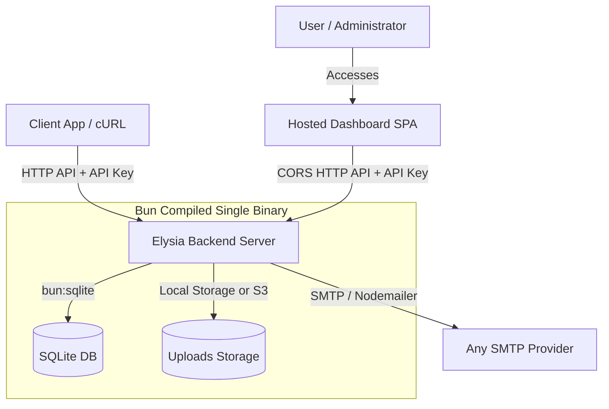

# Mail Buddy - Project Plan

**Mail Buddy** is an open-source, self-hostable email template manager and delivery API. It packages a beautiful React-based template editor (powered by React Email components/editor patterns) and a fast Elysia-based API into a **single-executable binary** compiled with Bun. 

---

## 1. System Architecture



### Key Design Goals:
- **Zero External Runtime Dependencies:** Distributed as a single compiled executable.
- **Ultra-Lightweight Footprint:** Decoupling the frontend SPA allows the backend server binary to be extremely small (< 20MB).
- **Embedded Database:** SQLite is used via the high-performance native `bun:sqlite` driver with Drizzle ORM.
- **Hosted UI Integration:** A central hosted web dashboard connects to any self-hosted IP and API key via CORS, eliminating local asset packaging issues.

---

## 1.5. Product Niche & Market Positioning

### Why Mail-Buddy? (Our Niche)
* **The Visual Editor Gap:** Most self-hosted mailing tools (like listmonk) expect users to write raw HTML or basic Markdown. Mail-Buddy addresses this by integrating a modern, drag-and-drop block builder (inspired by React Email/EmailBuilder.js) inside a self-hosted utility.
* **Single-Binary Portability & Drizzle:** Using Drizzle ORM and Bun's native SQLite driver avoids packaging heavy native Rust database engines. The self-hosted binary remains extremely compact (~15MB) and compiles cross-platform instantly.
* **Decoupled UI Architecture:** The React SPA Dashboard is hosted separately as a static website. The user connects their self-hosted server URL and Admin API Key in the dashboard settings (stored in their browser's local storage). This separates visual builder dependencies from backend logic, resulting in a cleaner development cycle and smaller deployment footprints.
* **Dynamic Template Embedding (`{{embed "uuid"}}`):** Mail-Buddy allows modular component design. Users can nest templates dynamically in Handlebars, automatically merging placeholders and required variables recursively.

### Storage Strategy (Local vs. S3)
To ensure stateless container friendliness (e.g. Docker hosting on Fly.io, Heroku, or ECS where local filesystems are ephemeral), Mail-Buddy supports two storage drivers configured via environment variables:
1. **`local` (Default):** Uploaded images are stored in a local directory (`./uploads`) alongside the binary.
2. **`s3`:** Uploaded images are uploaded directly to an S3-compatible bucket.
   * **Required Credentials & Settings:**
     * `STORAGE_PROVIDER=s3`
     * `S3_BUCKET_NAME` (The S3 bucket identifier)
     * `S3_ACCESS_KEY_ID` (AWS Access Key or provider counterpart)
     * `S3_SECRET_ACCESS_KEY` (AWS Secret Key or provider counterpart)
     * `S3_REGION` (e.g., `us-east-1`)
     * `S3_ENDPOINT` (Optional, for custom endpoints like Cloudflare R2, MinIO, or DigitalOcean Spaces)

---

## 2. Technical Stack

| Component | Technology | Rationale |
| :--- | :--- | :--- |
| **Runtime & Bundler** | [Bun](https://bun.sh/) | Fast runtime, built-in bundling/packaging, and native support for compiling into a single binary (`bun build --compile`). |
| **Backend Framework** | [Elysia.js](https://elysiajs.com/) | Extremely fast web framework for Bun with native TypeBox validation and OpenAPI/Swagger documentation. |
| **Database & ORM** | SQLite (`bun:sqlite`) & [Drizzle ORM](https://orm.drizzle.team/) | Extremely fast built-in SQLite driver paired with a zero-dependency, lightweight, type-safe query builder and automatic startup migrations. |
| **Authentication** | Custom Admin API Key / Token | Secure Bearer-token authentication matching values stored in database/environment settings, preventing CORS cookie restrictions. |
| **Frontend Framework** | React + Vite + TailwindCSS | Modern UI dashboard hosted as a separate static web application. |
| **Email Templating** | React Email & Handlebars | Component-based visual editing, HTML rendering, and resolving placeholders/conditionals via Handlebars.js. |
| **SMTP Delivery** | Nodemailer (or standard SMTP socket wrapper) | Robust email sending protocol support with TLS/SSL. |

---

## 3. Database Schema (Drizzle)

We will use Drizzle ORM to define the SQLite database schema and handle migrations.

```typescript
// src/db/schema.ts
import { sqliteTable, text, integer } from 'drizzle-orm/sqlite-core';

export const templates = sqliteTable('template', {
  id: text('id').primaryKey(), // UUIDv4
  name: text('name').notNull(),
  description: text('description'),
  htmlContent: text('html_content').notNull(),
  designJson: text('design_json'), // Serialized JSON string of editor state
  placeholders: text('placeholders').notNull(), // JSON string array of variable names
  createdAt: text('created_at').default('CURRENT_TIMESTAMP'),
  updatedAt: text('updated_at').default('CURRENT_TIMESTAMP'),
});

export const assets = sqliteTable('asset', {
  id: text('id').primaryKey(), // UUIDv4
  filename: text('filename').notNull(),
  originalName: text('original_name').notNull(),
  mimeType: text('mime_type').notNull(),
  fileSize: integer('file_size').notNull(),
  urlPath: text('url_path').notNull(),
  createdAt: text('created_at').default('CURRENT_TIMESTAMP'),
});

export const deliveryQueue = sqliteTable('delivery_queue', {
  id: text('id').primaryKey(), // UUIDv4
  recipient: text('recipient').notNull(),
  subject: text('subject').notNull(),
  htmlContent: text('html_content').notNull(),
  status: text('status').default('pending').notNull(), // 'pending', 'processing', 'sent', 'failed'
  attempts: integer('attempts').default(0).notNull(),
  maxAttempts: integer('max_attempts').default(5).notNull(),
  lastError: text('last_error'),
  runAt: text('run_at').default('CURRENT_TIMESTAMP').notNull(),
  createdAt: text('created_at').default('CURRENT_TIMESTAMP').notNull(),
});

export const deliveryLogs = sqliteTable('delivery_log', {
  id: text('id').primaryKey(), // UUIDv4
  recipient: text('recipient').notNull(),
  subject: text('subject').notNull(),
  templateId: text('template_id'),
  status: text('status').notNull(), // 'success', 'failed'
  errorMessage: text('error_message'),
  sentAt: text('sent_at').default('CURRENT_TIMESTAMP'),
});

export const settings = sqliteTable('setting', {
  key: text('key').primaryKey(),
  value: text('value').notNull(),
});
```

---

## 4. REST API Specification

### Authentication & Authorization
- **Token-Based Authentication:** Cross-origin communication is secured by passing an Admin API Key. No session cookies are required, preventing third-party cookie blocking issues.
- **Admin & Sending Endpoints:** All `/api/templates`, `/api/assets`, and `/api/send` endpoints are protected by a middleware that validates either `Authorization: Bearer <token>` or `X-API-Key` headers against settings.

> [!NOTE]
> Elysia's `@elysiajs/cors` plugin is enabled on the server to allow cross-origin requests originating from the hosted dashboard domain (e.g. `dashboard.mailbuddy.sh`).

### Template Management (`/api/templates`)
- **`GET /api/templates`**: List all templates.
- **`GET /api/templates/:id`**: Get detailed template data including HTML, JSON design state, and placeholders.
- **`POST /api/templates`**: Create a new template (exposes placeholder auto-extraction).
- **`PUT /api/templates/:id`**: Update an existing template.
- **`DELETE /api/templates/:id`**: Delete a template.

### Image Library (`/api/assets`)
- **`GET /api/assets`**: List all uploaded assets/images.
- **`POST /api/assets/upload`**: Upload a file (multipart/form-data). Saves files locally (default) or to an S3 bucket (if configured) and returns the public URL to view the asset.
- **`DELETE /api/assets/:id`**: Delete an asset from the storage engine (local/S3) and the database.

### Email Delivery (`/api/send`)
- **`POST /api/send`**: Triggers email delivery.
  - **Payload Structure**:
    ```json
    {
      "to": "recipient@example.com", // String or Array of strings
      "subject": "Reset your password",
      "templateUuid": "123e4567-e89b-12d3-a456-426614174000",
      "variables": {
        "username": "John Doe",
        "reset_link": "https://example.com/reset?token=abc"
      }
    }
    ```
  - **Behavior**:
    1. Fetches the main template by `templateUuid`.
    2. Recursively resolves any embedded templates referenced using the helper `{{embed "uuid"}}` from the database. A cycle-detection algorithm prevents infinite recursion loops.
    3. Dynamically extracts and merges the placeholder requirements of the main template and all embedded templates.
    4. Validates that all extracted placeholders (variables) are present in the request variables payload.
    5. Compiles the final template using **Handlebars.js**, where the custom `{{embed "uuid"}}` helper recursively renders the sub-templates.
    6. Sends the email via Nodemailer using configured SMTP credentials.
    7. Returns a status indicating success or failure along with the SMTP message ID.

---

## 5. UI/UX Design & Features (Hosted React SPA)

### Server Connection Setup:
- When a user opens the hosted dashboard (`dashboard.mailbuddy.sh`) for the first time, they are prompted to provide:
  - **Server URL:** The address of their self-hosted Mail-Buddy API server (e.g. `http://localhost:3000`).
  - **Admin API Key:** The secure API key generated by the server.
- These credentials are saved securely in browser `localStorage` and automatically appended to the HTTP headers of all API requests.

### Template Builder:
- **Visual Drag-and-Drop / Block Editor:** Integration of an open-source React Email editor/editor components allowing users to easily build complex layouts without writing raw HTML.
- **HTML Importer:** A dedicated interface to paste raw HTML, which is then parsed to auto-detect Handlebars placeholders and block expressions.
- **Placeholder Manager & Handlebars Parser:** Real-time AST (Abstract Syntax Tree) parsing of Handlebars templates to extract variables. It identifies:
  - Simple variables (e.g. `{{username}}`)
  - Conditional variables (e.g. from `{{#if showDiscount}}`, extracting `showDiscount`)
  - Loop/iterator variables (e.g. from `{{#each items}}`, extracting `items`)
  It automatically populates the template's placeholder list and displays required variable types in the UI.

### Template Composition (Dynamic embedding):
- Any template can serve as a component or layout. Users can embed any template within another template using a custom Handlebars helper, e.g., `{{embed "template-uuid"}}`.
- There is no distinction of template classes (no layout templates vs. normal templates); all templates are stored and treated identically.
- The system recursively extracts placeholders from embedded templates so they can be exposed as variables required by the top-level template.
- The UI editor dynamically resolves and renders the preview of all embedded sub-templates in real-time by querying the backend API.

### Asset Manager:
- Drag-and-drop file uploader.
- Grid view of all uploaded images.
- Copy-to-clipboard buttons for public image URLs to easily paste them into templates.

---

## 6. Single-Executable Packaging Strategy

To compile the Elysia backend into a single lightweight executable, we will implement a simplified build pipeline:

1. **Frontend Decoupling:**
   - The React SPA Dashboard is compiled and hosted on static hosting services (Vercel, Netlify, GitHub Pages) and is not bundled inside the binary.
2. **Database Engine Independence:**
   - Because Drizzle ORM does not use native query engines or migration binaries, the build target contains only pure, tree-shaken JavaScript.
   - SQL migrations are generated during development and embedded/run directly inside the TS code at startup using Bun's native SQLite driver.
3. **Compile Application:**
   - Run `bun build --compile --minify ./src/index.ts --outfile mail-buddy`.
   - The output is a single binary executable (`mail-buddy` or `mail-buddy.exe`) of around ~15MB.

---

## 7. Execution Checklist & Milestones

- [ ] **Milestone 1: Project Setup**
  - Initialize Bun workspace.
  - Configure Drizzle ORM with `bun:sqlite` built-in driver.
- [ ] **Milestone 2: Database Schema & Migration Runner**
  - Define Drizzle schema tables and generate migrations using `drizzle-kit`.
  - Implement automatic startup migration runner.
- [ ] **Milestone 3: Elysia API Server & SMTP Service**
  - Configure CORS middleware (`@elysiajs/cors`) to accept requests from the hosted UI.
  - Implement Bearer token/API Key authentication for all endpoints.
  - Develop template CRUD, assets uploader API, and SMTP queue/sender.
  - Add **Handlebars** template compilation engine and placeholder parser.
- [ ] **Milestone 4: Hosted React Dashboard SPA Development**
  - Implement server connection screen (saves URL & key in localStorage).
  - Develop template manager and asset list interfaces.
  - Integrate visual builder and raw HTML template importer.
  - Implement sub-template embedding preview and variable resolution.
- [ ] **Milestone 5: Binary Compilation & Verification**
  - Compile the API server to a single executable (`bun build --compile`).
  - Verify that the hosted SPA UI successfully manages templates and sends emails via the compiled server.

---

## 8. Technical Challenges & Production Considerations (Feedback & Mitigation)

### A. File/Binary Size (Resolved via Architecture)
* **Risk:** Bundling a full React SPA featuring a visual drag-and-drop template editor alongside native Prisma query/migration engines would expand the final compiled binary size up to 100MB+.
* **Mitigation:** Successfully mitigated by (1) moving the React SPA UI to a separate hosted server that communicates via CORS, and (2) swapping Prisma for Drizzle ORM which compiles to pure JavaScript without requiring any native query/migration engine binaries. The output executable size is reduced to a clean ~15MB.

### B. SQLite Concurrency under Transactional Load
* **Risk:** SQLite locks the entire database for writes. If your backend service receives highly concurrent send queries triggering queue writes and audit logs, SQLite might throw "Database is locked" exceptions.
* **Mitigation:** Enable SQLite's **WAL (Write-Ahead Logging)** mode via the `bun:sqlite` database instance options (running `db.run("PRAGMA journal_mode = WAL")` or `db.exec("PRAGMA journal_mode = WAL")` at initialization). WAL allows concurrent reads during writes and speeds up small transactional updates.

### C. Reliable SMTP Delivery & Queuing
* **Risk:** SMTP servers are slow and restrict rate-limiting. Sending synchronously during HTTP requests will lead to timeouts.
* **Mitigation:** The SQLite-backed `delivery_queue` is mandatory. The `/api/send` endpoint logs the job in the database, returns a `202 Accepted` immediately, and an internal worker processes jobs sequentially with an exponential backoff retry mechanism.
